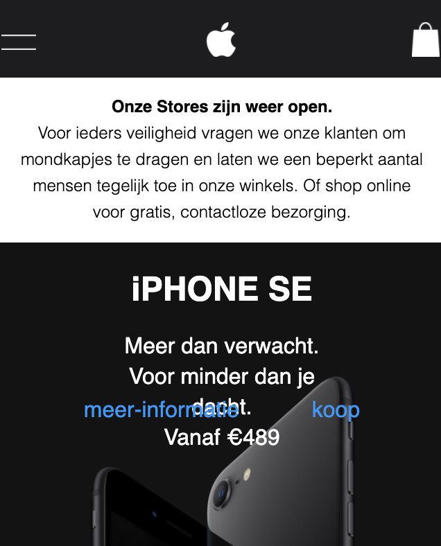
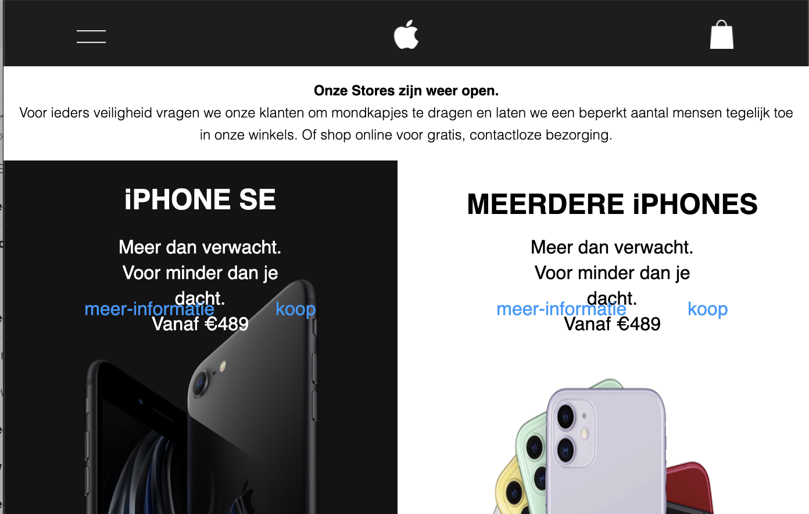
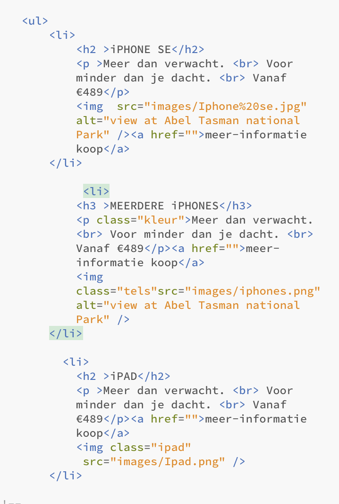
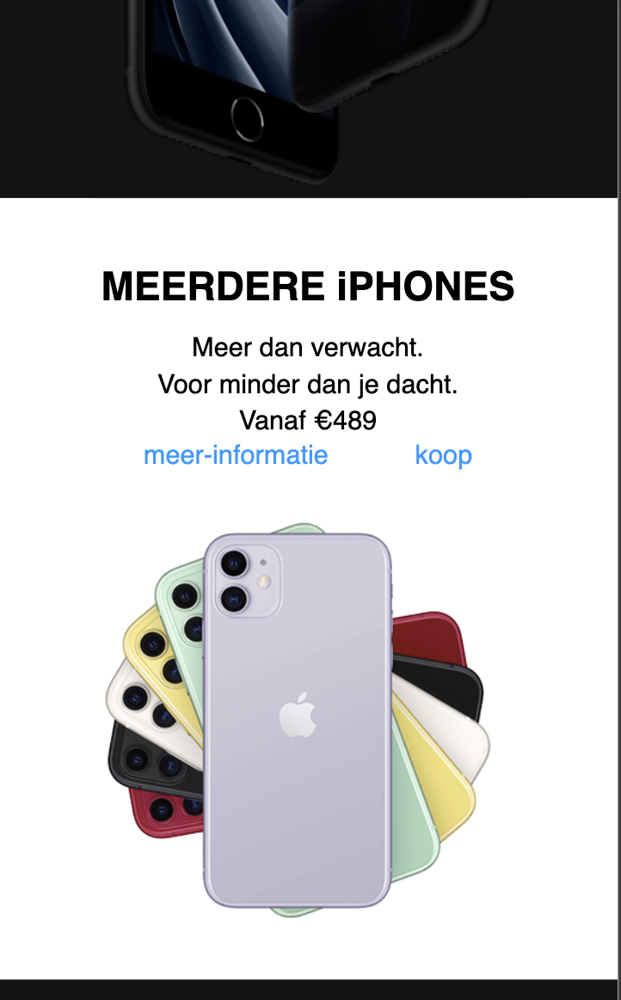
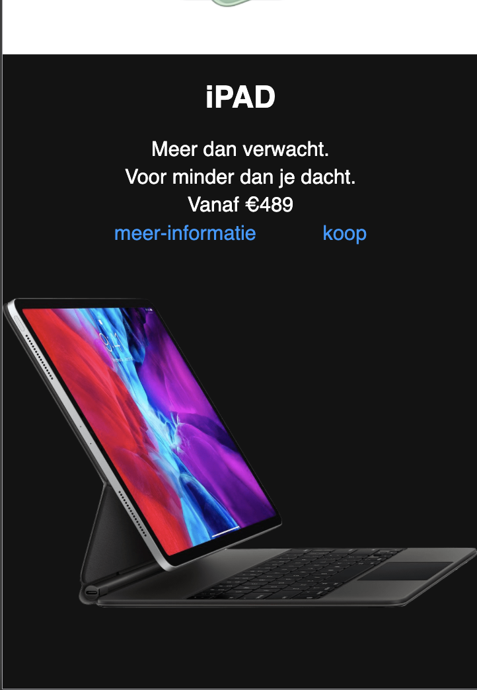

# Procesverslag
**Auteur:** -Thijs Scheper-

Markdown cheat cheet: [Hulp bij het schrijven van Markdown](https://github.com/adam-p/markdown-here/wiki/Markdown-Cheatsheet). Nb. de standaardstructuur en de spartaanse opmaak zijn helemaal prima. Het gaat om de inhoud van je procesverslag. Besteedt de tijd voor pracht en praal aan je website.

## Bronnenlijst
1. -bron 1-
2. -bron 2-
3. -...-

## Eindgesprek (week 7/8)

-dit ging goed & dit was lastig-

**Screenshot(s):**

-screenshot(s) van je eindresultaat-

## Voortgang 3 (week 6)

-same as voortgang 1-

## Voortgang 2 (week 5)

-same as voortgang 1-

## Voortgang 1 (week 3)

### Stand van zaken

Ik vind het nog lastig om bepaalde vlakken goed te positioneren, en vooral om ze mee te laten schalen. Dat gaat nog fout.

Ook vind ik het soms lastig om het juiste element op een goede manier op te roepen zonder een class of ID te gebruiken

**Screenshot(s):**

Tot nu toe ziet het er zo uit op mobiel

### Agenda voor meeting
- Het goed kunnen oproepen van H2tjes bijv
- het goed kunnen weg zetten van dingen onder elkaar.
- En het responsive maken

### Verslag van meeting

-Het kwam er op neer dat ik goed onderweg was maar wel netjes moest blijven werken. Anders kwamen er domme fouten omhoog. Ook moet ik nog bedenken welke pagina mijn tweede wordt en waar ik me Javascript ga toepassen.-

## Intake (week 1)

**Je startniveau:** Blauwe piste

**Je focus:** Responsive 

**Je opdracht:** https://www.apple.com/nl/

**Screenshot(s):**

**Breakdown-schets(en):**

