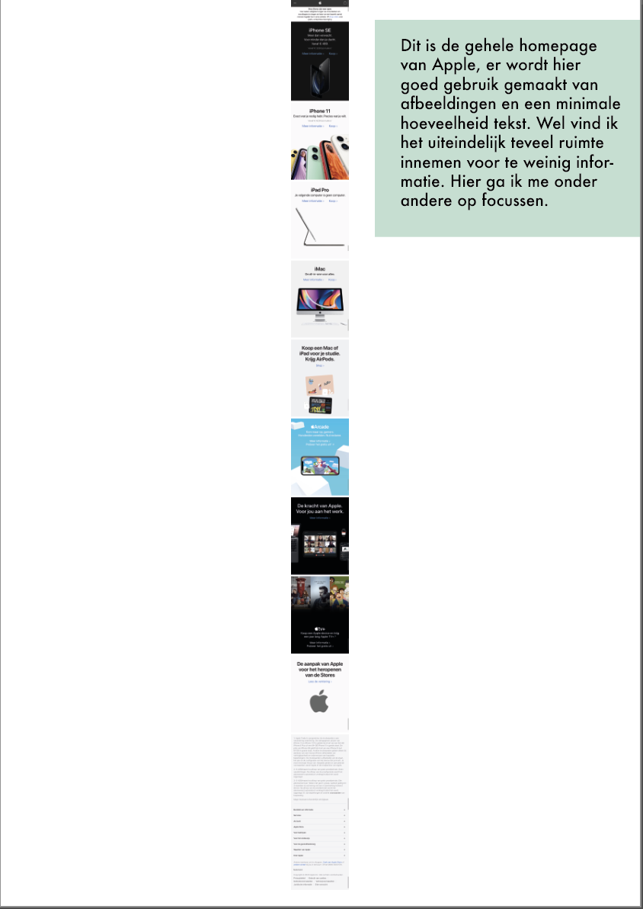
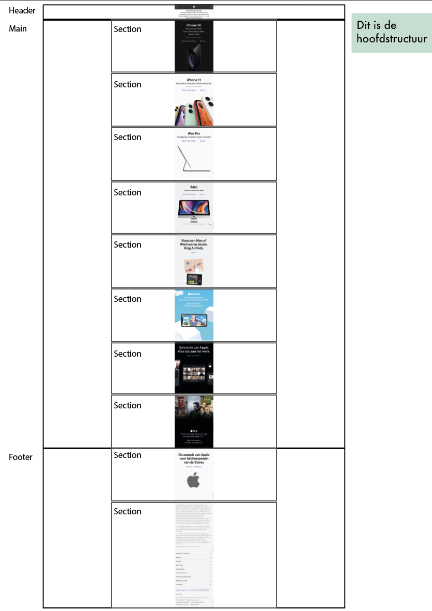
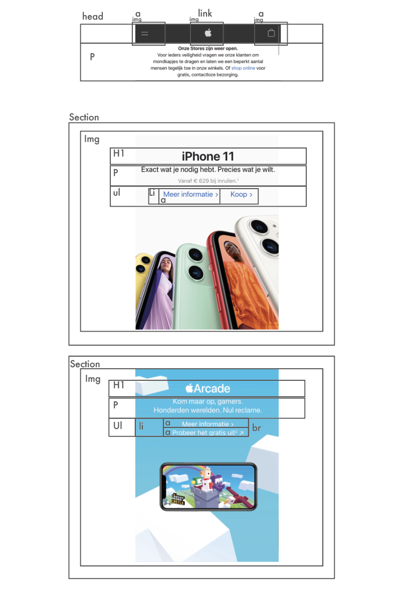

# Procesverslag
**Auteur:** -Thijs Scheper-

Markdown cheat cheet: [Hulp bij het schrijven van Markdown](https://github.com/adam-p/markdown-here/wiki/Markdown-Cheatsheet). Nb. de standaardstructuur en de spartaanse opmaak zijn helemaal prima. Het gaat om de inhoud van je procesverslag. Besteedt de tijd voor pracht en praal aan je website.

## Bronnenlijst
1. -bron 1-
2. -bron 2-
3. -...-

## Eindgesprek (week 7/8)

-dit ging goed & dit was lastig-

**Screenshot(s):**

-screenshot(s) van je eindresultaat-

## Voortgang 3 (week 6)

-same as voortgang 1-

## Voortgang 2 (week 5)

-same as voortgang 1-

## Voortgang 1 (week 3)

### Stand van zaken

Ik vind het nog lastig om bepaalde vlakken goed te positioneren, en vooral om ze mee te laten schalen. Dat gaat nog fout.

Ook vind ik het soms lastig om het juiste element op een goede manier op te roepen zonder een class of ID te gebruiken

**Screenshot(s):**

-screenshot(s) van hoe ver je bent-

### Agenda voor meeting

-samen met je groepje opstellen-

### Verslag van meeting

-na afloop snel uitkomsten vastleggen-

## Intake (week 1)

**Je startniveau:** Blauwe piste

**Je focus:** Responsive 

**Je opdracht:** https://www.apple.com/nl/

**Screenshot(s):**

**Breakdown-schets(en):**

